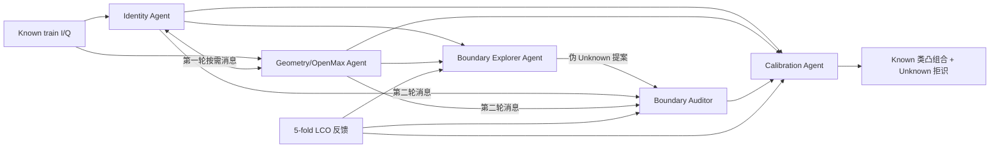

# Stage-5：角色化多智能体 OS-SEI 与候选 Agent 消融

## 目标与协议

Stage-5 在 WiSig 同日、同接收机的 `40 Known / 20 Unknown` 协议上，从头重构角色与协作链路。
40 个 Known 固定做五折 Leave-Class-Out（每折 32 个训练类、8 个代理 Unknown 类）；当前 20 个真实
Unknown 只在每个正式 seed 结束后离线评价，不参与训练、选轮、PUG/通信/融合规则选择或阈值设定。
初始规则只用 Known validation 的经验 CDF 校准到约 95% Known 接受率；后续性能筛选把接受率也作为
LCO 候选，在 Known Accuracy≥85% 约束下冻结，详见 `stage5_performance_screening.md`。

## Agent 与职责

1. **Identity Agent**：观察原始时域 I/Q，输出 Known 类 logits、能量/MSP/熵、可靠性和压缩消息。
2. **Geometry/OpenMax Agent**：观察 FFT 幅度与相位差，学习类原型、类内紧致性与竞争间隔，并输出
   原型距离和 EVT/OpenMax 证据。
3. **Boundary Explorer Agent（训练期）**：选择类内边缘、原型竞争或跨 Agent 分歧样本，沿竞争边界
   主动提出伪 Unknown。它有独立动作、覆盖率可靠性和 LCO 反馈，不接触测试 Unknown。
4. **Boundary Auditor Agent**：接收选择性消息、基础证据和跨专家分歧，只判断 Known/Unknown，不产生
   第三套类别 logits。
5. **Calibration Agent**：只用 Known validation 拟合类条件 CDF，把 Identity、Prototype、OpenMax、
   Boundary 的异构风险变为同尺度分数，再执行由 LCO 冻结的融合规则。
6. **Communication & Decision Coordinator**：进行两轮稀疏通信；类别只能是 Identity/Geometry logits
   的凸组合；每条边用删除消息后的任务损失变化获得反事实信用。

Reconstruction 不作为推理 Agent，只以联合状态重构下采样 I/Q 的辅助损失约束表示。

## 选择结果

LCO 冻结配置为：

- PUG：`mixed_eta1.5`；
- 通信：`sparse_cf`，预算 `0.5`；
- 校准：`Geometry + OpenMax + Boundary` 均值；
- 平均激活边数：LCO 中约 `2.71 / 4`。

固定无通信时，Calibration Agent 的 LCO 消融如下：

| 校准规则 | AUROC | OSCR | Unknown Recall | H-score |
|---|---:|---:|---:|---:|
| Boundary only | 0.811 | 0.799 | 0.094 | 0.167 |
| Identity + Prototype + Boundary | 0.919 | 0.882 | 0.411 | 0.550 |
| Geometry + OpenMax + Boundary | 0.919 | 0.870 | 0.569 | 0.679 |
| 四证据均值 | **0.932** | **0.884** | 0.568 | **0.685** |

在冻结的 `Geometry + OpenMax + Boundary` 校准上，LCO 的通信比较为：

| 通信 | OSCR | Unknown Recall | H-score | 平均边数 |
|---|---:|---:|---:|---:|
| 无通信 | 0.870 | 0.569 | 0.679 | 0.00 |
| 固定全通信 | 0.859 | 0.679 | 0.770 | 4.00 |
| 稀疏通信，预算 0.5 | 0.866 | 0.668 | 0.759 | 2.27 |
| 稀疏反事实通信，预算 0.5 | 0.862 | **0.691** | **0.775** | 2.71 |

## 正式 3-seed 结果

| 规则 | AUROC | OSCR | Known Acc | Unknown Recall | H-score |
|---|---:|---:|---:|---:|---:|
| Identity | 0.886±0.019 | 0.837±0.013 | 0.903±0.005 | 0.065±0.005 | 0.122±0.010 |
| Prototype | **0.936±0.004** | **0.889±0.003** | **0.917±0.002** | 0.310±0.060 | 0.460±0.069 |
| OpenMax | 0.847±0.033 | 0.787±0.029 | 0.891±0.006 | 0.643±0.031 | 0.747±0.019 |
| 等容量无通信 | 0.882±0.025 | 0.842±0.016 | 0.900±0.006 | 0.365±0.116 | 0.508±0.123 |
| 完整协作 | 0.900±0.032 | 0.847±0.024 | 0.897±0.006 | 0.611±0.109 | 0.721±0.075 |
| 协作模型推理关闭消息 | **0.936±0.010** | **0.881±0.004** | 0.894±0.007 | **0.679±0.085** | **0.769±0.050** |

完整协作相对独立训练的等容量无通信模型，按 Tx 分组的 paired bootstrap 给出
`ΔAUROC 95% CI=[+0.009,+0.028]`、`ΔH=[+0.204,+0.222]`；但在同一已训练模型中关闭消息反而更好。
因此当前结果证明“角色化表示 + Explorer + Auditor + Calibration”有效，尚未证明消息内容本身有净增益。

## 重构辅助项消融

保持 LCO 选择和其他配置冻结，seed42 去掉 reconstruction loss 后：

- `ΔAUROC=-0.0857`；
- `ΔOSCR=-0.0495`；
- `ΔUnknown Recall=-0.4469`；
- `ΔH=-0.3597`；
- `ΔKnown Accuracy=+0.0220`。

重构辅助约束应保留，但没有必要恢复成独立推理 Agent。该项目前是单 seed 组件消融，后续需要补齐三种子。

## 入口与产物

- 正式入口：`scripts/experiments/run_stage5.py`；
- 正式配置：`configs/experiments/stage5_role_agents_wisig.json`；
- Agent 候选排名：`scripts/experiments/analyze_stage5_candidates.py`；
- 冻结组件消融：`scripts/experiments/run_stage5_ablation.py`；
- 聚合结果：`results/stage5/wisig_k40u20/aggregate_stage5.md`；
- 候选报告：`results/stage5/wisig_k40u20/candidate_agent_ablation.md`。

下一轮优先扩展 Boundary Explorer 的动作空间并重构通信：保留有效的 Prototype/OpenMax/Calibration，
只让消息影响 Boundary 的残差审查或按需查询，逐边要求对同一模型的 `messages_off` 反事实产生正净增益。

> 后续 Stage-5B～H 已完成定向审计、残差审计、Decision Arbitrator、LCO 风险预算和分类别阈值消融。
> 最新三种子结果与负结果见 `docs/stage5_performance_screening.md`；本文件前述表格保留为初始 Stage-5 基线。
